# CS452 TC1 Report

## 1. System Overview

The Marklin Autonomous Train Control System represents a sophisticated real-time embedded solution for autonomous model train control.

### 1.1 High-Level Architecture


### 1.2 Key Capabilities

**Intelligent Pathfinding**: Trains automatically find optimal routes to destinations, considering track layout, switch positions

**Precise Motion Control**: Physics-based modeling enables accurate stopping at target locations within millimeter precision, accounting for each train's unique characteristics.

---

## 2. System Architecture

### 2.1 Real-Time Task Organization

The system employs a carefully designed task hierarchy that balances real-time requirements with system functionality. Higher priority tasks handle safety-critical operations, while lower priority tasks manage user interaction and system maintenance.


#### Task Design Rationale

**Critical Real-Time Layer (Priority 4)**: Notifier tasks that handle immediate hardware interrupts and time-critical events. These tasks have the highest priority to ensure deterministic response to hardware events.

**Core System Layer (Priority 5)**: Essential system services including train control, communication, and coordination. These tasks form the backbone of the train control system and run at high priority to maintain real-time guarantees.

**Application Layer (Priorities 7-10)**: Application-specific tasks like sensor polling and user interface that can tolerate some scheduling delay while still maintaining system responsiveness.

**Background Layer (Priority 31)**: The idle task runs when no other tasks require CPU time, managing power consumption and system maintenance.

### 2.2 Communication Architecture

The system implements a publish-subscribe messaging pattern that decouples task interactions while maintaining real-time guarantees.

```mermaid
graph TB
    subgraph "Message Flow"
        SENSORS[Sensor Triggers]
        SWITCHES[Switch States]
        POSITIONS[Train Positions]
        SIGNALS[Signal States]
    end

    subgraph "Central Hub"
        MSGQUEUE[Message Queue<br/>Priority-based Delivery<br/>Buffered Communication]
    end

    subgraph "Subscribers"
        TRAIN_SUB[Train Tasks<br/>Subscribe to:<br/>• Sensor events]
        CONTROLLER_SUB[Controller<br/>Subscribe to:<br/>• Status changes<br/>• Position updates<br/>]
        UI_SUB[User Interface<br/>Subscribes to:<br/> Sensor Events<br/>]
    end

    SENSORS --> MSGQUEUE
    SWITCHES --> MSGQUEUE
    POSITIONS --> MSGQUEUE
    SIGNALS --> MSGQUEUE

    MSGQUEUE --> CONTROLLER_SUB
    MSGQUEUE --> TRAIN_SUB
    MSGQUEUE --> UI_SUB
```



### 2.3 Operational Flow

The system operates through well-defined interaction patterns that ensure safety while maintaining operational efficiency.

```mermaid
sequenceDiagram
    participant User as User Interface
    participant Conductor as Traffic Controller
    participant Train as Train Task
    participant Hardware as Hardware Layer
    participant Physical as Physical Train

    Note over User, Physical: Train Navigation Request
    User->>Train: "Go to destination X"
    Train->>Conductor: "Find path to X"
    Conductor->>Conductor: Calculate optimal route
    Conductor->>Train: "Route: A→B→C→X"

    Note over User, Physical: Route Execution
    Train->>Conductor: "Reserve block A, B, C, X"
    Conductor->>Train: "Block A-C reserved"
    Train->>Hardware: "Set speed, direction"
    Hardware->>Physical: Physical control signals

    Note over User, Physical: Position Tracking
    Physical->>Hardware: Sensor triggered
    Hardware->>Train: "Sensor A3 triggered"
    Train->>Train: Update position model
    Train->>Conductor: "Release previous block"

    Note over User, Physical: Continuous Operation
    loop Every 10ms
        Train->>Train: Calculate stopping distance
        Train->>Hardware: Adjust speed as needed
        Hardware->>Physical: Speed adjustments
    end
```



---

## 3. Conductor Module

The Conductor module functions as the central traffic control authority, orchestrating safe multi-train operations through intelligent block management, signal control, and optimal pathfinding. It ensures that trains can operate autonomously while maintaining safety through exclusive track access control.

### 3.1 Block-Based Safety System

The track layout is divided into discrete, self-contained blocks that serve as the fundamental units of train safety and coordination. Each block represents a section of track with well-defined boundaries and exclusive access control.

```mermaid
graph TB
    subgraph "Block Architecture"
        subgraph "Block 2"
            A_ENTRY[Entry Sensor<br/>C13, E8]
            A_INTERNAL[Internal Components<br/>• Empty]
            A_EXIT[Exit Sensors<br/>E7, C14]
            A_ENTRY --> A_INTERNAL --> A_EXIT
        end

        subgraph "Block 7"
            B_ENTRY[Entry Sensors<br/>E7, D8]
            B_INTERNAL[Internal Components<br/>• Empty]
            B_EXIT[Exit Sensors<br/>E8, D7]
            B_ENTRY --> B_INTERNAL --> B_EXIT
        end

        subgraph "Block 12"
            C_ENTRY[Entry Sensors<br/>D7, D6, E9, D10]
            C_INTERNAL[Internal Components<br/>• Switch 9, Switch 8]
            C_EXIT[Exit Sensors<br/>D8, D5, E10, D9]
            C_ENTRY --> C_INTERNAL --> C_EXIT
        end
    end

    A_EXIT -.-> B_ENTRY
    A_EXIT -.-> C_ENTRY
    B_EXIT -.-> C_ENTRY

    subgraph "Block State Management"
        STATE[Block State<br/>• Owner Train ID<br/>• Reservation Time<br/>• Physical Occupancy<br/>• Entry Point]
    end
```



#### Block Design Principles

**Exclusive Ownership**: Only one train may reserve a block at any time, preventing collisions by ensuring trains cannot occupy the same track section simultaneously.

**Complete Containment**: All possible paths between any two boundary sensors remain entirely within the block, guaranteeing that trains cannot accidentally exit into uncontrolled territory.

**Switch Authority**: The train that owns a block has exclusive control over all switches within that block, preventing conflicting switch commands that could derail trains.

**Independent Detection**: Physical occupancy detection operates independently from reservations, providing redundant safety verification through sensor networks.

### 3.2 Signal System Integration

The system implements a three-aspect signal system that automatically regulates train speeds based on track conditions ahead. **Note**: For TC1, this system is not enforced but provides the infrastructure for future expansion.


### 3.3 Intelligent Pathfinding

The conductor employs sophisticated pathfinding algorithms based on Dijkstra's shortest path algorithm, enhanced with railway-specific considerations including reversals, block awareness, and safety constraints.

```mermaid
graph TB
    subgraph "Pathfinding Process"
        REQUEST[Path Request<br/>From: Current Position<br/>To: Destination]

        subgraph "Algorithm Core"
            GRAPH[Track Graph<br/>Nodes & Edges]
            COSTS[Cost Calculation<br/>• Distance<br/>• Reversal Penalty<br/>• Block Status]
            DIJKSTRA[Dijkstra Search<br/>Priority Queue<br/>Optimal Path]
        end

        subgraph "Railway Enhancements"
            REVERSAL[Reversal Safety<br/>Min 5000mm length]
            BLOCKS[Block Awareness<br/>Current switch positions]
            SWITCHES[Switch Tracing<br/>Determine actual exits]
        end

        RESULT[Path Result<br/>• Node sequence<br/>• Switch settings<br/>• Reversal points]
    end

    REQUEST --> GRAPH
    GRAPH --> COSTS
    COSTS --> DIJKSTRA
    DIJKSTRA --> REVERSAL
    REVERSAL --> BLOCKS
    BLOCKS --> SWITCHES
    SWITCHES --> RESULT
```



#### Pathfinding Enhancements

**Reversal Safety Validation**: Before allowing a train to reverse, the system verifies that sufficient track length exists both behind the train (minimum 5000mm traveled) and ahead (minimum 5000mm available) to safely execute the maneuver.

**Block-Aware Exit Selection**: When a train is positioned at a block entry sensor, the pathfinding system traces through the block's internal switches using their current positions to determine which specific exit sensor the train will actually reach, rather than assuming a default exit.

**Cost-Based Optimization**: The algorithm assigns costs to different path options:
- **Base Cost**: Physical distance in millimeters
- **Reversal Penalty**: Additional 5000mm cost equivalent to discourage unnecessary reversals
- **Block Conflicts**: Higher costs for paths requiring busy blocks


---

## 4. Train Module

The Train module represents the brain of each autonomous train, implementing physics-based motion control, learning systems, and navigation capabilities. Each train operates as an independent agent while coordinating with the central conductor for safe multi-train operations.

### 4.1 Autonomous Operating Modes

The train system supports three distinct operating modes, each tailored for different operational requirements and levels of autonomy.


#### Mode Characteristics

**Manual Mode**: Provides direct human control over train operations, used for testing, maintenance, or situations requiring human intervention. The train responds immediately to user commands without autonomous decision-making.

**Waypoint Mode**: Implements full autonomous navigation where trains intelligently navigate to specified destinations. This mode combines pathfinding, collision avoidance, signal compliance, and precise stopping control.

**Road Mode**: Enables signal-following behavior without predetermined destinations, similar to real railway operations where trains proceed based on signal states and traffic conditions.

### 4.2 Physics-Based Kinematic Modeling

The heart of the train control system lies in its sophisticated physics engine that models each train's unique characteristics with exceptional precision using fixed-point arithmetic.


#### Precision Engineering

The system achieves remarkable precision through several design decisions:

**Fixed-Point Arithmetic**: Using 64-bit integers with a 10^8 scale factor provides 8 decimal places of precision, ensuring deterministic calculations without floating-point uncertainties that could compromise real-time guarantees.

**Individual Train Profiles**: Each train maintains its own complete kinematic model, accounting for differences in motor characteristics, weight distribution, wheel condition, and other factors that affect performance.

**Multi-Parameter Modeling**: The system tracks velocity, acceleration, deceleration, stopping distance, and stopping time for each of the 28 possible speed levels, creating a comprehensive performance profile.

### 4.3 Adaptive Calibration System

The system continuously learns and adapts to each train's characteristics through sophisticated offline calibration experiments. This adaptive approach ensures optimal performance as trains age and conditions change.


#### 4.3.1 Velocity Calibration Methodology

The velocity calibration process uses a precisely measured track loop to determine each train's actual speed characteristics at different control levels.

```mermaid
graph LR
    subgraph "Velocity Measurement Process"
        START[Train at Sensor B5<br/>Speed Level Set]
        LOOP1[Loop 1: B5→C11→B5<br/>Time Measurement]
        LOOP2[Loop 2: B5→C11→B5<br/>Time Measurement]
        LOOP3[Loop 3: B5→C11→B5<br/>Time Measurement]
        LOOP4[Loop 4: B5→C11→B5<br/>Time Measurement]
        LOOP5[Loop 5: B5→C11→B5<br/>Time Measurement]

        CALC[Calculate Average<br/>Total Distance divided by Total Time<br/>equals Actual Velocity]
    end

    START --> LOOP1
    LOOP1 --> LOOP2
    LOOP2 --> LOOP3
    LOOP3 --> LOOP4
    LOOP4 --> LOOP5
    LOOP5 --> CALC

    subgraph "Speed Setting Protocol"
        APPROACH[Proper Speed Approach<br/>• From higher vs lower]
    end

    START -.-> APPROACH
```



**Key Insights**:
- Multiple loops provide statistical accuracy and account for minor variations
- Proper speed approach sequences ensure consistent train behavior
- The known loop distance provides a precise measurement baseline

#### 4.3.2 Acceleration Analysis

Acceleration calibration employs a sophisticated two-scenario algorithm that accounts for the reality that trains may complete their acceleration before reaching the measurement endpoint.


#### 4.3.3 Stop Distance Optimization

The stop distance calibration uses a binary search algorithm to find the optimal timing for issuing stop commands, achieving precise stopping at target locations.


#### 4.3.4 Deceleration Derivation

Deceleration values are calculated using fundamental physics equations, deriving precise values from the empirically measured velocities and stopping distances.

**Physics Foundation**: Using the kinematic equation v² = v₀² + 2ad, where:
- v = final velocity (0 for stopping)
- v₀ = initial velocity (measured)
- a = acceleration (negative for deceleration)
- d = stopping distance (measured)

**Calculation**: Solving for deceleration gives us: **a = -v₀² / (2d)**

This physics-based approach ensures consistency between measured stopping performance and the mathematical model used for real-time predictions.

### 4.4 Real-Time Control Integration

The train's autonomous operation seamlessly integrates all calibrated parameters into real-time decision making, creating a responsive and intelligent control system.


### 4.4 Intelligent Navigation Control

The autonomous control system operates through a sophisticated state machine that manages all aspects of train navigation and safety.


#### Waypoint Mode Intelligence

In waypoint mode, the train demonstrates autonomous intelligence through:

**1. Dynamic Path Management**: Continuously monitors path validity and requests new routes when needed

**2. Automatic Reversal Execution**: Detects reversal points in the path and executes reversals seamlessly without human intervention

**3. Signal Compliance**: Automatically adjusts speed and stopping behavior based on track signal states

**4. Predictive Position Tracking**: Maintains continuous awareness of location using sensor fusion and motion prediction

**5. Safety-First Decision Making**: Prioritizes safety over efficiency in all navigation decisions

#### Precision Stopping System

The stopping control integrates multiple data sources to achieve millimeter-precision stops:


---

## 5. Miscellaneous Systems

### 5.1 Broken Sensor Tracking

**File**: `src/uapps/include/marklin/common/blacklisted_sensors_list.h`

The system maintains a compile-time list of non-functional sensors that should be excluded from pathfinding and sensor processing:

```c
// Track A broken sensors
BROKEN_SENSOR(MARKLIN_TRACK_TYPE_A, "B10")
BROKEN_SENSOR(MARKLIN_TRACK_TYPE_A, "B9")
BROKEN_SENSOR(MARKLIN_TRACK_TYPE_A, "C2")

// Track B broken sensors
BROKEN_SENSOR(MARKLIN_TRACK_TYPE_B, "C12")
```

**Usage**: The `BROKEN_SENSOR` macro is defined differently in various contexts to:
- Exclude sensors from pathfinding algorithms
- Skip sensor validation in topology
- Generate runtime blacklist arrays
- Provide debugging information

### 5.2 Edge Resistance Compensation

**File**: `src/uapps/include/marklin/common/edge_resistance_list.h`

Track segments have varying conditions affecting train performance. The system compensates using resistance coefficients:

```c
// Resistance coefficient format (fixed-point with scale 1000):
// 1000 = normal resistance (1.0)
// 1200 = 20% higher resistance
// 600 = 40% lower resistance

// Track A resistance configurations
TRACK_RESISTANCE(MARKLIN_TRACK_TYPE_A, "BR8", "D9", 1200)    // 20% higher
TRACK_RESISTANCE(MARKLIN_TRACK_TYPE_A, "D9", "E12", 1200)
TRACK_RESISTANCE(MARKLIN_TRACK_TYPE_A, "E12", "D11", 1200)
TRACK_RESISTANCE(MARKLIN_TRACK_TYPE_A, "D11", "C16", 1200)

// Track B resistance configurations
TRACK_RESISTANCE(MARKLIN_TRACK_TYPE_B, "MR1", "A9", 600)     // 40% lower
```

**Applications**:
- **Velocity Calibration**: Adjust expected speeds on high-resistance curves
- **Stop Distance Adjustment**: Account for braking effectiveness variations

### 5.3 Topology Server

The topology server maintains the track layout graph and provides distance calculation services:

#### Services Provided
- **Distance Calculation**: Between any two track nodes
- **Resistance Lookup**: Resistance for track segments
- **Path Validation**: Verify track connectivity
- **Node Information**: Type, connections, properties

### 5.4 Message Queue System

**File**: `src/uapps/include/marklin/msgqueue/msgqueue.h`

Provides reliable inter-task communication with the following features:

#### Message Structure
```c
typedef struct {
    marklin_msgqueue_event_type_t event_type;  // Message classification
    u32 data_size;                             // Payload size
    u64 timestamp;                             // Creation time
    u8 data[MARKLIN_MSGQUEUE_MAX_DATA_SIZE];   // Payload data
} marklin_msgqueue_message_t;
```

#### Queue Management
- **Per-subscriber Queues**: Each subscriber has dedicated message buffer
- **Overflow Handling**: Configurable buffer sizes with overflow detection
- **Nonblocking Operations**: Tasks can poll without blocking

---

## 6. Calibration Data Storage

### 6.1 Raw Calibration Data Repository Location

The system's calibration data is stored within the main source code repository in a structured format that enables version control and reproducible builds.

**Primary Calibration Data Directory:**
```
src/uapps/marklin/train/
├── model_defaults.c          # Raw calibration data storage
├── model.c                   # Kinematic model implementation
├── calibration.c             # Calibration algorithms
└── offline_*.c               # Automated calibration experiments
```

**Calibration Data File:** `src/uapps/marklin/train/model_defaults.c`

This file contains the persistent calibration data for all supported trains in the system.

### 6.3 Supported Train Models

The system currently maintains calibration data for the following train models:

| Train ID | Calibration Status | Speed Levels Calibrated | Data Quality |
|----------|-------------------|-------------------------|--------------|
| **14** | Fully Calibrated | 12-27 (16 levels) | Complete velocity, acceleration, stopping |
| **16** | Partially Calibrated | 17-27 (11 levels) | Velocity only |
| **18** | Partially Calibrated | 10-27 (18 levels) | Mixed calibration data |
| **15** | Uncalibrated | 0 levels | Default values only |
| **17** | Uncalibrated | 0 levels | Default values only |
| **55** | Uncalibrated | 0 levels | Default values only |

### 6.4 Calibration Data Format

Raw calibration values are stored as fixed-point integers with a scale factor of 10^8, providing 8 decimal places of precision:

**Example Train 14 Calibration Data (Speed Level 17):**
```c
{278584624, 46919, 1014516, 386, 275, 0, 0, 0}
//    ^        ^        ^      ^    ^
//    |        |        |      |    └─ Stop time: 275 ticks
//    |        |        |      └──── Stop distance: 386 mm
//    |        |        └─────────── Deceleration: 10.14516 mm/tick²
//    |        └──────────────────── Acceleration: 0.00046919 mm/tick²
//    └───────────────────────────── Velocity: 2.78584624 mm/tick
```

### 6.5 Data Collection and Updates

Calibration data is collected through automated offline experiments and updated in the source code:

1. **Offline Velocity Calibration**: Loop-based measurements for steady-state velocity
2. **Offline Acceleration Calibration**: Two-scenario algorithm for acceleration profiles
3. **Offline Stop Distance Calibration**: Binary search optimization for precise stopping
4. **Data Integration**: Results are manually integrated into `model_defaults.c` after validation

This approach ensures that calibration improvements are version-controlled and can be shared across development environments.
